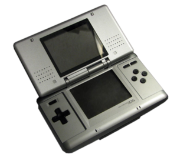
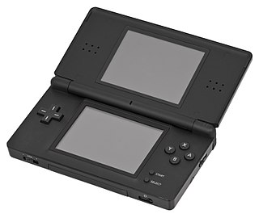
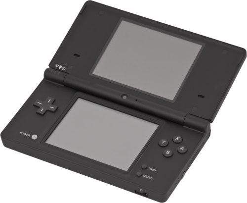
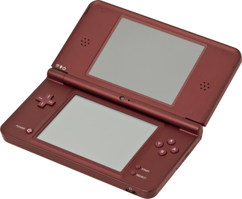

# ハードウェア一覧

[公式サイト](https://www.nintendo.co.jp/ds/)

## ニンテンドーDS(初代DS)

- コードネーム: NTR
- 発売日(日本): 2004/12/2
- 全世界売り上げ: 1879万台

## ニンテンドーDS Lite

- コードネーム: USG
- 発売日(日本): 2006/3/2
- 全世界売り上げ: 9386万台

## ニンテンドーDSi

- コードネーム: TWL
- 発売日(日本): 2008/11/1
- 全世界売り上げ: 2844万台

## ニンテンドーDSi LL

- コードネーム: UTL
- 発売日(日本): 2009/11/21
- 全世界売り上げ: 1293万台

